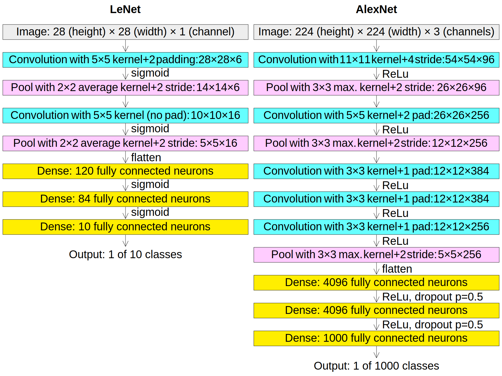
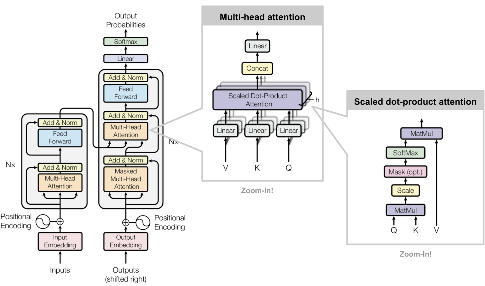

# Thesis

## 摘要

多模态情感分析是传统的基于文本或者图像的情感分析的一个新任务，它超出了传统单模态情感分析范围，引入了多种模态的数据用于进行情感分析。它可以包括两种模态的不同组合，例如文本和图像，也可以包含三种模态，例如文本，视频，音频。随着近年来社交媒体的蓬勃发展，出现了文本和图像等不同形式的大量社交媒体数据，由此传统的基于文本或者图像的情感分析已演变为更复杂的多模式情感分析。与传统的情感分析类似，多模式情感分析中最基本的任务之一就是情感分类，它将不同的情感分为积极，消极或中立的类别。要解决多模态情感分析主要有两个问题，1）如何编码文本，图像的特征，2）如何融合文本特征，图像特征。

当下大火的视觉Transformer在多个计算机视觉任务中都取得了超出卷积神经网络的效果。受这一点启发，本文采用视觉Transformer来解决图像情感分析任务。在此基础上，解决多模态情感分析任务。试图达到更高的准确率以及更统一的模型结构。

本文的主要工作如下几个方面

- 基于视觉Transformer的图像情感分类

  利用几个具有代表性的视觉Transformer解决传统的图像情感分析，并与传统基于卷积神经网络的方法进行比较。为基于视觉Transformer的多模态情感分析打下基础。

- 基于Transformer结构的多模态编码模型

  基于多模态情感分析数据集的特点，对已有的视觉Transformer和BERT进行组合，以解决相关任务。并与传统基于卷积神经网络和BERT的方法进行比较。

- 多模态特征融合

  针对不同模态的特征向量，选取不同的融合方式，进行特征融合。比较不同的特征融合方式对于模型准确率的影响，选择最佳的特征融合方法。

- 模型部署与展示

  对上述几种模型进行部署与可视化展示。

**关键词**：多模态情感分析，视觉Transformer，多模态特征融合

## Abstract

Multi-modal sentiment analysis is a new task of traditional text or image-based sentiment analysis. It goes beyond the scope of traditional single-modal sentiment analysis and introduces multi-modal data for sentiment analysis. It can include different combinations of two modalities, such as text and image, or three modalities, such as text, video, and audio. With the vigorous development of social media in recent years, a large number of different forms of social media data such as text and images have emerged. As a result, traditional text or image-based sentiment analysis has evolved into more complex multi-modal sentiment analysis. Similar to traditional sentiment analysis, one of the most basic tasks in multi-modal sentiment analysis is sentiment classification, which divides different sentiments into positive, negative or neutral categories. There are two main problems to solve multi-modal sentiment analysis, 1) how to encode text and image features, and 2) how to fuse text and image features.

The current popular vision Transformer has achieved significant results beyond convolutional neural networks in multiple computer vision tasks. Inspired by this, this article utilizes the vision Transformer to solve the task of image sentiment analysis. On this basis, the task of multi-modal sentiment analysis is solved. This paper tries to achieve a higher accuracy rate and a more unified model structure.

The main work of this paper is as follows

- Image sentiment classification based on vision Transformer

   Use several representative vision Transformers to solve traditional image sentiment analysis, and compare with traditional methods based on convolutional neural networks. Try to lay the foundation for multi-modal sentiment analysis based on vision Transformer.

- Multi-modal coding model based on Transformer structure

   Based on the characteristics of the multi-modal sentiment analysis data set, the existing vision Transformer and BERT are combined to solve related tasks. Also,  compare it with the traditional method based on convolutional neural network and BERT.

- Multi-modal feature fusion

   According to the feature vectors of different modalities, different fusion methods are selected to perform feature fusion. Compare the effects of different feature fusion methods on the accuracy of the model, and choose the best feature fusion method.

- Model deployment and display

   Deploy and visualize the above models.

## 绪论（1～5）

### 研究背景及研究意义

- 多模态情感分析

  随着计算机以及社交媒体的迅速成长，越来越多的人开始在网络上表达自己的情感。国内外著名的社交媒体有Twitter，Instagram，微博，微信等等。在这些社交平台上，人们通过图片，文字，视频等多种方式展现出自己的观点以及情绪，表达方式变得越来越丰富。每天都有海量的数据出现在社交平台上，这就给研究人员提出了一个挑战：如何分析多模态数据，尤其是以声音，图像，文本为基础的多模态数据中的情感。如果能够自动识别出这些数据的情感，那么就能及时的删除一些负面的言论（种族歧视，造谣言论等等），也能正确的宣扬一些正面的言论（爱党，爱国等等）。

  在传统情感识别领域当中，研究人员大多数只关注单个模态的数据。例如图像情感分析只着眼于挖掘和推理图像中蕴含的情感；文本情感分析中只聚焦在文本输入上。而多模态情感分析的难度不止是单模态情感分析只和。一方面，多模态信息之间可以互相补充，例如一张阳光明媚的照片配上一句“真是个好天气！”，显然流露出正面的情绪。但是如果把图片换成一张暴雨如注的图片，再配上“真是个好天气！”，就表现出一种讽刺的语气。这时，文本模态输入与图片模态输入之间就不是互相补充的关系，而是某种矛盾关系。但这种矛盾关系，在人类眼中，是很自然的讽刺。而对于模型来说，要解决上面的现象，有很大难度。具体来说，如何将不同模态的输入联系到一起，如何区分不同模态输入之间是互补的关系，还是矛盾的关系。

  （配图）

  多模态情感分析有很多应用场景，除了识别社交媒体上用户的言论之外，还可以用于人机交互领域当中。例如智能机器人，当其在与用户交流时，可以基于摄像头中用户的肢体动作与表情和麦克风中用户的语调识别出用户的情感，从而进行回应，使得回应更加自然，合理。

  从上面几点来看，多模态情感分析任务的提出源自于现实应用的需求。社交媒体给予人们多种表达情感的方式，计算机就应该有能力分析这些数据。多模态数据无疑会囊括大量的信息，如何利用这些信息，如何提取多模态数据的特征，如何对多模态特征进行融合，使得能够提升单模态情感分析的准确率，而不是起反作用。如何利用多模态数据之间的对齐信息，从而对不同模态输入之间的关系进行建模，例如人们看见“猫”这个字，脑海中就会浮现出猫的样子。这些都是当前多模态情感分析领域所面临的问题。这一领域是一个新生领域，现在提出的模型还远远达不到人类的水平，因此也引起了研究人员的大量关注。

- 视觉Transformer

  Transformer架构是谷歌在2017年提出的，并且在各大自然语言处理任务当中都取得了领先的效果。特别是在此架构上进行预训练后得到的模型，例如BERT，Roberta，T5。其最大的特点就是抛弃了循环神经网络，而用自注意力机制进行替代。使得模型可以并行的处理文本。鉴于Transformer架构优越的性能，以及很容易就能迁移到下游任务上并且取得优越的效果，研究人员开始尝试用Transformer架构替代卷积神经网络来解决计算机视觉当中的一些任务，并在近期取得了一些不错的成果。例如目标检测领域当中的DETR，图像分类领域当中的vision transformer

本文的主要致力于研究利用视觉Transformer解决多模态情感分析问题，试图达到超越卷积神经网络的效果。

### 研究现状

为了研究多模态情感识别，研究人员提出了大量数据集，同时在这些数据集上提出的许多模型，进行了大量的实验，下面就对一些典型的数据集以及模型算法进行具体介绍。

#### 数据集

多模态情感分析数据集主要分为两大类：对话式与非对话式

- 对话式

  这类数据集中的样本往往都由多个句子和多张图片组成。数据来源通常为电视剧中人物对话。比较经典的数据集有MEISD，MELD ，IEMOCAP，SEMAINE。对话式的样本往往需要考虑上下文，结合语境来给出情感分类，例如下图中的例。因此往往需要更复杂的模型，更巧妙的算法，这不是本文的重点，因此不再赘述

- 非对话式

  这类数据集中的样本都有一句话，配上一张图片，或者一段视频。数据来源通常为社交媒体平台，例如Twiter，Facebook，比较经典的数据集有CMU-MOSI，CMU-MOSEI，CMU-MOSEAS，UR-FUNNY，CH-SIMS，MVSA-SINGLE。由于没有上下文，因此只需要考虑不同模态输入之间的关联就可给出情感分类，这正是本文关注的重点。

  值得关注的一类数据集是涉及讽刺检测，仇恨检测的数据集，例如Twitter反讽数据集，Hateful Meme数据集。这些数据集中的样本往往涉及了讽刺，仇恨言论。即图像与文本之间的联系是反直觉的，这也体现了多模态情感识别任务的复杂。

#### 多模态情感识别相关方法

这一部分主要聚焦在非对话式数据集上的一些模型。对于对话式数据集不会涉及。

- VistaNet

  该模型主要用于涉及文本和图片两种模态的情感分类任务。其中心思想为“图片并不独立于文字表达情感，而是作为辅助部分提示文本中的显著性内容”。

  如图1所示，VistaNet具有三层结构，分别是词编码层、句子编码层和分类层。词编码层对一个句子中的词语进行编码，再经过soft-attention得到句子的表示。句子编码层对上一层得到的句子表示进行编码，再通过视觉注意力机制（visual aspectattentino）得到文档表示。文档表示作为分类层的输入，输出分类结果。从结构上来看，VistaNet和Hierarchical Attention Network基本相似，都是用于文档级情感分类，都有三层结构，且前两层都是GRUEncoder+Attention的结构，二者的不同点在于VistaNet使用了视觉注意力机制。

- HFM（HierarchicalFusion Model）

  该模型主要用于涉及文本和图片的讽刺检测任务。在文本和图像双模态的基础上，增加了图像的属性模态（Image attribute），由描述图像组成成分的若干词组成。如图3所示，图片包含了“Fork”、“Knife”、“Meat”等属性。作者认为图像属性能够将图像和文本的内容联系起来，具有“桥梁”的作用。

  根据功能将HFM划分为三个层次，编码层、融合层和分类层，其中融合层又可分为表示融合层和模态融合层。HFM在编码层首先对三种模态的信息进行编码，得到每种模态的原始特征向量(Raw vectors)，即每个模态的所有元素的向量表示集合。对原始特征向量进行平均或加权求和后得到每个模态的单一向量表示(Guidancevector)。原始特征向量和单一向量表示经过表示融合层后,得到融合了其他模态信息的每个模态的重组特征向量表示（Reconstructedfeature vector）。最后将三个模态的重组特征向量经过模态融合层处理，得到最后的融合向量（Fusedvector），作为分类层的输入。

- TFN

  该模型主要用于涉及文本，图像，语音三种模态的情感分类任务。Zadeh和他的团队[4]提出了一种基于张量外积（Outer product）的多模态融合方法，这也是TFN名字的来源。在编码阶段，TFN使用一个LSTM+2层全连接层的网络对文本模态的输入进行编码，分别使用一个3层的DNN网络对语音和视频模态的输入进行编码。在模态融合阶段，对三个模态编码后的输出向量作外积，得到包含单模态信息、双模态和三模态的融合信息的多模态表示向量，用于下一步的决策操作。

- MARN

  该模型主要用于涉及文本，图像，语音三种模态的情感分类任务。其基于一个假设：“模态间存在多种不同的信息交互”，这一假设在认知科学上得到了证实。MARN基于此提出使用多级注意力机制提取不同的模态交互信息。模型架构如图5所示。在编码阶段，作者在LSTM的基础上提出了“Long-shortTerm Hybrid Memory”，加入了对多模态表示的处理，同时将模态融合和编码进行了结合。由于在每个时刻都需要进行模态融合，要求三种模态的序列长度相等，因此需要在编码前进行模态对齐。

- MFN（Memory Fusion Network）

  MARN考虑了注意力权重的多种可能分布，MFN则考虑了注意力处理的范围。MFN和MARN一样将模态融合与编码相结合，不同的是，在编码的过程中模态间是相互独立的，由于使用的是LSTM，并没有一个共享的混合向量加入计算，取而代之的，MFN使用“Delta-memoryattention”和“Multi-View Gated Memory”来同时捕捉时序上和模态间的交互。保存上一时刻的多模态交互信息。图6展示了MFN在t时刻的处理过程。

#### 视觉Transformer

由于Transformer架构的强大效果，研究人员开始探索其在计算机视觉领域的应用，最早的视觉Transformer是目标检测领域中的DETR，其在目标检测任务上取得了不错的效果，且时间成本要低于传统的卷积神经网络。近几个月出现了大量用于图像分类，目标检测的视觉Transformer，最典型的有Vision Transformer（ViT），Swin Transformer（SwinT）等等。关于这些模型的具体结构将会在下一章节进行介绍，这里就不赘述。

### 工作内容/目标

本文主要有以下几个工作内容/目标

- 基于视觉Transformer的图像情感分类

  现如今有关视觉Transformer的研究主要还是聚焦在图像识别上，即识别出图片中的物体类别，也就是图像浅层信息。至今还没有工作验证其在图像情感识别上的效果，即识别出图像中物体所透露的情感，也就是图像深层信息。这对于后面将要介绍的多模态情感是至关重要的，只有先验证了视觉Transformer在图像情感识别的能力，才能将其拓展到多模态情感识别当中。本文将会尝试多种视觉Transformer架构，包括ViT，SwinT，TnT，PiT。

- 基于Transformer结构的多模态编码模型

  在上一个工作内容基础上，本文重点研究利用Transformer架构对多模态输入进行编码。主要有两种编码方式。1）文本，图片分开编码。对于文本，可以使用当下流行的BERT，其模型结构就是基于Transformer Encoder，再加上在大量语料库上预训练得来。对于图片，可以采用各种视觉Transformer。2）文本，图片统一编码。即使用一个统一的模型，其可以接收文本和图片这两种模态的输入。具体来说，要先将文本和图片拼接成一个统一的输入，输入该模型。得到多模态特征，用于情感分类

- 多模态特征融合

  在上一个工作的第一种编码方式基础上，需要对不同模态的特征进行特征融合，得到全局特征，用于情感分类。本文研究多种融合方式，包括early-fusion，late-fusion等等，并比较这些不同融合方式对于模型准确率的影响，从而选出最适合视觉Transformer的一种融合方式，作为最终的模型

- 模型部署与展示

  在上述几个工作内容的基础上，为了便于展示模型效果，本文将利用Streamlit在搭建网页应用，部署模型。用于展示基于Transformer的多模态情感分析模型

### 论文结构

本文主要研究了基于视觉Transformer的多模态情感分析模型，文章的主要结构如下

- 绪论

  绪论部分首先详细阐述了多模态情感分析以及视觉Transformer的研究背景以及研究意义。说明了多模态情感分析所面临的问题与挑战，以及研究人员为了解决这些问题所做出的尝试，同时介绍了Transformer在计算机视觉领域当中的应用。其次具体说明了本文的工作内容以及目标，最后简单介绍了本文的文章结构。

- 相关原理和技术

  这一部分具体介绍了设计图像分类，文本分类以及多模态分类三个任务的相关原理和技术。即卷积神经网络，视觉Transformer用于解决图像分类任务，BERT用于解决文本分类任务，卷积神经网络与BERT结合用于解决多模态分类任务。对其中每一种神经网络的模型结构和训练方法都进行了具体介绍

- 模型设计与实验

  这一部分具体介绍了本文所采用的模型。即用视觉Transformer解决图像情感分类任务，BERT解决文本情感分类任务，视觉Transformer和BERT的结合解决多模态情感分类任务。对这些模型在不同数据集上的实验结果进行具体分类，并进行了相关性实验以探索模型中不同模块的作用和影响。

- 模型部署与展示

  这一部分介绍了本文是如何利用进行网页搭建和模型部署的。即利用Streamlit可视化的展示模型预测结果。

- 总结与展望

  最后一部分对于本文进行了总结，对本文提出的模型优点以及缺点进行分析，并指出未来可以探索的方向。

## 相关原理和技术（6～12）

这一部分主要介绍一些处理分类任务的方法，分别从图像分类，文本分类以及多模态分类三个任务来详细阐述，具体到每个任务都有多种常见的方法，下面一一说明。

- 图像分类任务
  
  给定一张图片$P$，试图找到一个模型$f$，在某种损失函数$L$下，其误差$L(f(P),y)$最小，其中$y$是图片$P$的标签。常用的方法主要是卷机神经网络。但在最近一段时间，以ViT为代表的一系列视觉Transformer被研究者提出，并且在视觉分类任务上取得了不俗的效果，下面进行详细介绍
  
  - 卷积神经网络
  
    和传统的全连接神经网络一样，卷积神经网络由输入层，隐藏层，输出层。其中隐藏层通常包含多个卷积层，每个卷积层涉及一系列卷积，池化，全连接，归一化操作。具体来说，卷积指的是卷积核与输入特征的点积操作，且通常为Frobenius内积，激活函数通常为RELU或者Sigmoid。当卷积核沿着该层的输入矩阵滑动时，卷积运算将生成一个特征图，该特征图便是下一层的输入。 接下来是其他层，例如池化层，全连接层和归一化层。下图是两种卷积神经网络的结构，LeNet早在20世纪90年代就已被提出，用于解决数字识别问题。而AlexNet的出现，大幅提升了Imagenet图像识别的准确率，也是近年来深度学习热潮的先驱。现如今，残差神经网络Resnet已是卷积神经网络的代表。
  
    
  
  - 视觉transformer
  
    鉴于Transformer在自然语言处理领域中的统治地位，近几个月，研究人员探索Transformer架构在图像中的应用。ViT(Vision Transformer)，完全抛弃卷积操作，而遵循Transformer架构，在图像识别领域取得了不俗的效果。其模型结构如下。
  
    
  
    对于一张图片$P$，首先将其切割为若干个图片块（Patch），每个图片块的大小固定，且切割顺序固定。将每个Patch输入给一个线性层，将它们映射成一维张量。在该张量前面添上一个特殊占位符【class】，用于分类。再加上位置编码后输入给一个Transformer编码器。将【class】占位符的隐变量通过一个线性层用于分类。
  
    ViT使用的Transformer编码器与传统的Transformer类似，输入张量首先经过Layer Normalization，在输入给Multi-Head Attention层做自注意力点积，还配备有残差连接。最后再通过一个Layer Normalization层和一个全连接层。
  
    随着ViT的出现，越来越多的研究人员开始探索视觉Transformer，也因此出现了很多变种，包括Swin Transformer（SwinT），Transformer in Transfomer（TNT），Pooling-based Vision Transformer（PiT），本文也重点研究这几种具有代表性的视觉Transformer。
  
  - 预训练视觉模型
  
    上面一部分介绍了视觉Transformer的结构，这里介绍其预训练过程以及实验结果。
  
    Vision Transformer的预训练过程与传统预训练有差别。传统的预训练是无监督学习，拿BERT举例，只需要大量的无标注文本，即可进行预训练（会在下文详述）。而Vision Transformer进行的是有监督预训练。具体来说就是预测图像所属类别，并与真实值进行比较，计算损失函数，梯度回传，更新参数。迁移到下游任务上也仅仅是更换数据集。因此这也是视觉Transformer的令人诟病之处。
  
    但这不影响其优越的实验结果，拿Swin Transformer举例，无论是在图像分类任务上，还是在目标检测任务上，都取得了优于卷积神经网络的效果。下表列举了一些主要的结果，可以看到，Swin Transformer的效果超过了所有卷积神经网络。
  
- 文本分类任务

  给定一句文本$T$，试图找到一个模型$f$，在某种损失函数$L$下，其误差$L(f(T),y)$最小，其中$y$是文本$T$的标签。最初用于解决文本分类任务的是循环神经网络，代表模型有LSTM，GRU。其主要思想就是将文本逐词输入给模型，一个时间点上模型只处理一个单词，即串行处理输入。但自从Transformer提出后，循环神经网络几乎已被遗忘。Transformer的主要思想是自注意力机制（Self-Attention）。一个很大的优点就是可以并行处理文本输入，即整个句子同时输入给模型。大大减少了时间开销。Transformer的效果也远远超出了LSTM/GRU。下面对其模型结构以及预训练目标进行详细阐述。
  
  - self-attention
  
    
  
    Self-attention的主要组成部分是Multi-head Attention，其又是有多个Scaled dot-product Attention构成。该点积操作可用如下公式表示
    $$
    Attention(Q,K,V) = softmax(\frac{QK^T}{\sqrt{n}})V
    $$
    
  
    其中$Q,K,V$分别代表Query，Key，Value。三者都是由同一个输入张量，经过线性变换得倒，这也是称其为“自”注意力机制的原因。$n$代表张量的维度。由于张量维度较高，因此在进行点积操作时，得到的结果数值可能会很大，因此要除以$\sqrt{n}$进行缩小。所谓Multi-Head就是指有多个自注意力头，再将每个头的输入进行拼接以得到最后的输出结果。具体公式如下
    $$
    MultiHead(Q,K,V) = [head_1,head_2,...,head_h]W^O\\
    where\ head_i = Attention(QW_i^Q,KW_i^K,VW_i^V)
    $$
    
  - 预训练语言模型
  
    上述内容介绍了Self-attention的结构，但使Transformer真正强大起来的是预训练技术。最近火热的BERT以及各种变种，包括Roberta，Deberta，T5，中心思想都是通过预训练来提升模型的表示能力。因此BERT的真正作用就是用于编码文本数据，为下游分类器提供文本特征。下面会具体介绍BERT的两个预训练目标
  
    1）Mask Language Model
  
    ​	对于每句文本，随机将15%的单词用一个特殊占位符【MASK】替换。将替换后的文本输入给一个Transformer Encoder。再用【MASK】位置上的隐变量进行单词预测，与真实值进行比较并计算损失函数，更新参数。注意这里的真实值就是替换之前的单词，故不需要人工标注
  
    2）Next Sentence Prediction（NSP）
  
    ​	这里的输入由两个文本构成，并在第一个文本之前加上一个特殊占位符【CLS】，在两句文本之间添加一个特殊占位符【SEP】，再将其输入给Transformer Encoder。再用【CLS】位置上的隐变量进行分类，判断第二句句子是否是第一句句子的下一句，与真实值进行比较并计算损失函数，更新参数。注意这里也不需要人工标注。对于正样本，只需要选取语料库中连续的两句句子；对于负样本，只需要随机选取语料库中的两个句子。
  
    针对上面两种任务，研究人员选取BooksCorpus（包含八亿个英语单词）以及Wikipedia（包含25亿个英语单词）作为语料库。这也是最基础的BERT版本：bert-base-uncased
  
    在预训练完成之后，就可以将BERT迁移到下游任务上。拿文本情感分类举例。只需要将文本前加上一个【CLS】占位符，输入给BERT，把【CLS】位置上的隐变量通过一个线性层做分类。除此之外，BERT还可以用于阅读理解，文本翻译，文本生成等几乎所有自然语言处理任务。
  
    
  
- 多模态分类任务

  上面的介绍都只涉及单模态的输入，这部分则会介绍当输入模态数量大于1时，现有的模型及算法。通常会涉及到图片模态，文本模态，故下面就拿这两种模态进行举例。主要分为两种处理方式

  - late/early fusion

    对于图像输入$P$，设计一个编码器$f_P$；同样的，对于文本输入$T$，设计一个编码器$f_T$。将不同模态输入通过各自的编码器得到隐变量。再将不同模态的隐变量进行特征融合，得到全局特征。将其通过一个分类器，得到预测结果，与真实值比较，计算损失函数并更新参数。不同算法的区别主要在于特征融合的方式，具体来说主要分为两种方法

    1）early-fusion：这种方法会先对不同模态的特征进行融合，再通过分类器进行分类

    2）late-fusion：这种方法会先对不同模态的特征进行分类，再对不同模态的分类结果进行分析得到最终分类结果。

    图像的编码器通常使用卷积神经网络，例如Resnet，Mobilenet。文本的编码器通常使用BERT。本文要研究的主要是将图像编码器替换为视觉Transformer对于效果的提升，以及不同的特征融合方式对于模型准确率的影响。

  - 多模态transformer

    多模态Transformer的中心思想就是利用一个模型对多个模态的输入进行编码。那么第一个任务就是要讲不同模态的输入整合为一个统一的输入。最常见的方法如下

    对于图像输入$P$，先利用一个特征提取器将其转化为一系列一维的特征图。再将这些特征图拼接到文本输入的后面，组成一个统一的输入。再将其输入给一个多模态Transformer进行编码。将【CLS】位置上的隐变量通过一个分类器，得到预测结果，与真实值进行比较，计算损失函数并更新参数。不同算法的区别主要在预特征提取器的选取以及多模态Transformer的选取。

    特征提取器通常使用在Imagenet上预训练好的Resnet。多模态Transformer通常使用BERT。本文主要研究的是将特征提取器替换为视觉Transfomrer对于模型准确率的影响。

## 设计与实现（13～25）

本章首先介绍本文解决多模态情感分析的方法，包括符号定义，数据预处理，模型结构，训练细节等。在此之上，对实验结果进行分析。同时做了控制实验用于对模型中不同框架对作用进行分析。

在介绍具体的方法之前，先对一些下文常用到的符号进行定义

|         $X_t$          |             文本输入             |
| :--------------------: | :------------------------------: |
|         $X_i$          |             图像输入             |
| $Y_t(\overline {Y_t})$ | 文本对应的标签（文本模型的预测） |
| $Y_i(\overline {Y_i})$ | 图像对应的标签（图像模型的预测） |
|   $Y(\overline {Y})$   |   综合文本，图像的标签（同上）   |
|         $M_t$          |        用于编码文本的模型        |
|         $M_i$          |        用于编码图像的模型        |
|          $M$           |            多模态模型            |
|         $H_t$          |        文本模态的特征向量        |
|         $H_i$          |        图像模态的特征向量        |
|          $H$           | 融合后的特征向量（全局特征向量） |
|         $L_t$          |         文本模态的Logits         |
|         $L_i$          |         图像模态的Logits         |
|          $L$           |           多模态Logits           |

### 数据预处理

- 文本预处理

  本文选取的数据集中的文本大多数为英语，因此首先将其全部转为小写，在去除收尾的空白符号（换行，制表符），再直接使用空格进行分词。分词之后，并在首部加上【CLS】占位符（用于分类），尾部加上【SEP】占位符，利用BertTokenizer进行转化为词表中的索引。具体来说，在BERT进行预训练的时候，会维护一个词表，记录所有输入的单词。在解决下游任务的时候，直接使用该词表来进行词到索引的转换，对于预训练中没有出现过的单词，将其转换为一个特殊的【UNK】占位符。将转换后的文本输入记为$X_t$
  $$
  X_t \leftarrow BertTokenizer([CLS],X_t,[SEP])
  $$

- 图像预处理

  为了适配模型，首先将图像的大小调整为256\*256，再截取图像中间的224\*224个像素点作为最终的图像，并将每个像素值除以255，转换到【0，1】这个区间当中。由于模型大多数都在Imagenet上预训练，因此需要将输入的图片按照Imagenet数据集的均值和标准差进行归一化。具体来说。图像为RGB三通道，故对每一个通道都进行归一化。记为$X_i$。具体来说每个通道的均值分别为0.485, 0.456, 0.406，标准差分别为0.229, 0.224, 0.225。
  $$
  X_i \leftarrow \frac{X_i - mean}{std}
  $$

### 基于视觉transformer的图像情感分类

​	对于图像情感分类，这里采用以Vision Transformer（ViT）为代表的一系列视觉transformer。视觉transformer最初提出是用于图像分类，目标检测这类视觉任务中，即识别出一张图像中的物体，本文将其称为图像的浅层信息。但情感识别任务需要判断出图像中的物体所蕴含的情感，本文将其称为图像的深层信息。

​	具体来说，给定图像输入$X_i$
$$
H_i = ViT(X_i) \\
\overline{L_i} = W^T(H_i) \\
\overline{Y_i} = \arg \max(Softmax(\overline{L_i})
$$
​	其中，$H_i$为编码后的图像特征，通常为一个高维向量（ViT中为1024维）。 $W$为可学习的矩阵，用于将ViT编码后的隐变量变换为输出维度的向量，输出维度即为情感种类个数，通常为二或者三。$Softmax(y)_j = \frac{e^{y_j}}{\sum_{k}e^{y_k}}$

​	训练过程中用交叉熵作为损失函数
$$
Loss = CrossEntrophy(\overline{L_i}, Y_i)
$$

​	交叉墒函数表达式如下
$$
CrossEntrophy(t,y) = -\sum_{k}t_k\log y_k
$$
 	其中$t$为真实值，$y$为预测值。

### 基于BERT的文本情感分类

​	由于预训练模型的强大编码能力，BERT已经取代了以LSTM/GRU为代表的循环神经网络。故对于文本情感识别直接采用BERT进行分类。BERT是由若干个transformer encoder堆叠而成，并且在Wikipedia上进行无监督预训练得到的模型。有关BERT的更详细内容可见相关原理部分。Huggingface提供了一套规范的接口，以及预训练好的参数。这里直接采用其提供的模型。这里选择BERT的版本是“bert-base-uncased”。

​	具体来说，给定文本输入$X_t$
$$
\overline{L_t} = W^T(BERT(X_t)) \\
\overline{Y_t} = \arg \max(Softmax(\overline{L_t})
$$
​	其中，$W$为可学习矩阵，用于将BERT编码后的隐变量变换为输出维度的向量，输出维度即为情感种类个数，通常为二或者三。

​	训练过程中同样使用交叉熵作为损失函数
$$
Loss = CrossEntrophy(\overline{L_t}, Y_t)
$$

### 多模态情感分类

​	对于多模态情感分类任务，主要有两个研究内容，1）如何编码各个模态的输入。2）如何融合不同模态的特征。这部分主要解决第一个问题，而把第二个问题放在Ablation Study中进行探索

​	编码部分主要分为两种处理方式。1）利用不同的模型对不同模态的输入进行编码，即图像编码器编码图像，文本编码器编码文本。再将编码后的模态特征向量进行特征融合，最后将全局特征输入给一个分类器进行情感分类。2）将不同模态的输入拼接成一个全局输入，输入给一个模型进行编码，即多模态编码器，最后直接将特征向量输入个一个分类器。下面具体介绍这两种方法。

- 不同模态输入单独编码

  

  该模型的具体结构见图，左半部分代表图像编码器，这里的Image_Encoder可以卷机神经网络，也可以是视觉Transformer；而Text_Encoder是BERT。对于具体的编码方式在前面两个部分已经具体介绍过了，这里只从特征融合这一步开始具体介绍。

  首先将图像特征$H_i$,文本特征$H_t$拼接为全局特征$H$，即
  $$
  H = concatenate(H_i,H_t)
  $$
  再将$H$输入给一个线性分类层得到logits，再通过一个softmax层得到概率分布
  $$
  \overline{L} = W^TH \\
  \overline{Y} = \arg \max {Softmax(\overline{L})}
  $$
  与单模态情感分类类似，训练过程中使用交叉墒作为损失函数

- 不同模态输入统一编码，Multimodal BERT(MMBT)

  

  该模型的具体结构见图，编码流程可以分为两部分

  1）首先利用一个图片编码器提取出图像的特征。具体来说，拿Resnet152举例。将倒数第二层的特征图（feature map）进行池化后，变换成若干个1*1的特征图。同样的，这里也可以使用视觉Transformer作为图像编码器，即直接将【CLS】位置上的隐变量作为图像特征
  $$
  X_i \leftarrow Image\_Encoder(X_i) \\
  X = Concatenate(X_t,X_i)
  $$
  

  2）将这些特征拼接到文本模态输入的后面，作为全局输入。将其输入到BERT当中，利用【CLS】对应的隐变量进行分类。数学公式如下
  $$
  H = BERT(X)\\
  \overline{L} = W^TH\\
  \overline{Y} = \arg \max Softmax(\overline{L})
  $$
  同样的，训练过程中的损失函数为交叉墒

  

### 实现细节

本文所有代码均使用python实现，涉及到模型流水线的代码使用Pytorch框架，涉及到模型具体结构的代码使用Huggingface和Timm开源仓库。其中Huggingface仓库包含了大量的预训练语言模型，包括BERT，Roberta，Deberta等，Timm包含了大量的预训练视觉模型，包括Resnet，ViT，SwinT等。

这里选择使用Huggingface提供的AdamW作为优化器，所有实验都在亚马逊云服务提供的Tesla T4 GPU上运行。具体的开源代码可见https://github.com/zhangjiahui-buaa/Thesis。

更具体的超参数列在附录中。

### 实验结果

#### 评价指标

这里具体介绍本文实验中的两种评价指标

- Accuracy（准确率）：分类正确个数/总数
- AUROC（操作特征曲线下的面积）：AUROC为ROC曲线下的面积。 ROC曲线显示了不同决策阈值的真阳性率（TPR）和假阳性率（FPR）之间的权衡。其中真阳性率为TP/(TP+FN)，假阳性率为FP/(FP+TN)，TP代表True positive（真值为1且预测为1），TN代表True negative（真值为0且预测为0），FP代表False positive（真值为0但预测为1），FN代表False negative（真值为1但预测为0）。

#### 实验数据集

这里具体介绍本文实验中将会用到的两个多模态情感识别数据集

- MVSA Single Dataset

  MVSA源自社交媒体Twitter上用户发表的言论，囊括了日常生活中的各个方面。该数据集包含5000个样本。由于没有标准的训练集-验证集划分，本文直接随机选取500个样本作为验证集。每个样本包括一张图片，一句文本以及对应的图片情感标签和文本情感标签。但没有提供多模态情感标签（综合考虑图片和文本后得到的情感标签）。因此该数据集主要用于单模态情感分析，具体来说：验证视觉transformer解决图像情感分析的能力以及验证BERT解决文本情感分析的能力。

  

- Hateful Meme Dataset

  Hateful Meme数据集是由Facebook提供一个用于检测仇恨言论的数据集，包含10000个训练样本，500个验证样本，以及2000个测试样本。同样的，每个样本包括一张图片，一个文本。与MVSA不同的是，Hateful Meme数据集只提供多模态情感，即综合考虑图像和文本后标注的情感标签。由于涉及到仇恨检测，通常需要综合考虑文本和图像才能得到正确的情感。因此在本文中，该数据集主要用于多模态情感分析。

贴图

有关数据集更详细信息列在了附录中

#### 实验模型

这里简单介绍一下实验中用到的三种模型，更具体的模型结构可以参照前文的相关工作一部分

- 卷积神经网络Resnet152：该模型是典型的卷积神经网络，在计算机视觉领域中已经有广泛的应用，这里将其作为主要的基线模型用以比较。
- 视觉Transformer（Vit，Swint，TNT，PiT）：这些模型都是最近一段时间出现的视觉Transformer模型，并且在图像识别，目标检测一系列视觉任务中达到了与CNN媲美的效果，Swint在一些任务上的效果甚至超过了当前的SOTA模型。
- 多模态Transformer（MMBT）：该模型是基于Transformer架构的用于解决多模态任务的模型。

#### 图像情感分类

本文第一个研究点是探索Transformer对于图像的编码能力，这里选用MVSA数据集中的图片进行实验。表格中带有Vanilla前缀的模型代表该模型没有在Imagenet上预训练过。从结果上可以看出，Swint的准确率和AUROC都是最高的。同时，所有视觉Transformer的AUROC都要高于Resnet152的AUROC，这验证了视觉Transformer提取图像深层信息的能力是不逊于卷机神经网络。

|          | Resnet152 | Vit   | Swint     | TNT   | PiT   |
| -------- | --------- | ----- | --------- | ----- | ----- |
| Accuracy | 67.50     | 66.75 | **67.75** | 66.75 | 66.00 |
| AUROC    | 78.89     | 81.19 | **81.79** | 78.94 | 80.42 |

#### 文本情感分类

文本情感分类结果如下，这里选用MVSA数据集中的文本进行实验。由于MVSA数据集是源自推特用户的言论，当中包含大量不规范的语言，特别是OOV（out of vocabulary）单词，例如网址url，单词缩写。由于在预训练中没有出现过，这些词在通过BertTokenizer时会转化为同一个特殊占位符【UNK】。大量的【UNK】会影响BERT的表示能力，这也解释了为何文本情感分类准确率如此之低。

|          | BERT  |
| -------- | ----- |
| Accuracy | 54.50 |
| AUROC    | 65.41 |

#### 多模态情感分类

下表对应着第一种编码方式，即不同模态采用不同编码器。由于文本编码器均为BERT，故下表只列出了图像编码器。从准确率上来看，每个模型的效果都差不多，Vit以微弱的优势取得第一名，略高于Resnet152和其余视觉Transformer。但从AUROC上来看，所有的视觉Transformer都要高出Resnet152四到五个点。验证了视觉Transformer强大的图像的编码能力能够提升多模态情感识别的准确率。

| Image Encoder | Resnet152 | Vit       | Swint | TNT   | PiT   |
| ------------- | --------- | --------- | ----- | ----- | ----- |
| Accuracy      | 60.40     | **61.60** | 60.00 | 59.40 | 60.60 |
| AUROC         | 62.90     | **66.80** | 66.20 | 65.37 | 65.66 |

下表对应着第二种编码方式，即多模态Transformer统一编码多模态输入。同样的，每一列代表着不同的图像特征提取器。结果在意料之中，无论从准确率还是从AUROC的结果来看，视觉Transformer都要优于卷积神经网络

| MMBT Image Encoder | Resnet152 | Vit       | Swint | TNT       | PiT   |
| ------------------ | --------- | --------- | ----- | --------- | ----- |
| Accuracy           | 60.60     | 62.40     | 61.40 | **63.80** | 62.60 |
| AUROC              | 65.57     | **68.79** | 67.40 | 66.78     | 66.92 |

### Ablation studies

这一部分对于模型中相关模块的作用进行探索，主要试图回答如下几个问题

- 是否需要预训练

  对于Transformer模型来说，预训练基本上是一个默认的设定，近年来大火的BERT，Roberta，T5等等都是在各种庞大的语料库上先预训练，再用于下游任务当中。Vision transformer也一样，上述的ViT，Swint，TnT，PiT都是在ImageNet数据集上预训练后迁移到下游的视觉任务当中。一个自然的问题是，一个未预训练过的Vision Transformer（即参数随机初始化）的效果如何（这里特指和未预训练过的卷积神经网络进行比较）

  |          | Resnet152 | Vanilla Resnet152 | Vanilla ViT | Vanilla Swint | Vanilla TNT | Vanilla PiT |
  | :------: | :-------: | :---------------: | :---------: | :-----------: | :---------: | :---------: |
  | Accuracy |   67.50   |       56.00       |    58.75    |   **59.25**   |    58.75    |    58.50    |
  |  AUROC   |   78.89   |     **66.21**     |    65.45    |     61.02     |    64.61    |    62.85    |

  |          |  ViT  | Vanilla ViT | Vanilla Swint | Vanilla TNT | Vanilla PiT |
  | :------: | :---: | :---------: | :-----------: | :---------: | :---------: |
  | Accuracy | 61.60 |    57.4     |     56.60     |    55.40    |  **58.00**  |
  |  AUROC   | 66.80 |    62.78    |     62.86     |    62.82    |  **63.28**  |

  第一张表格是在MVSA数据集上进行图像情感分类得到的结果，可以看出，Resnet152的AUROC值位列第一，说明预训练对于Transformer的提升要大于对于卷积神经网络的提升。这一点是符合直觉的。因为卷积操作天生就有提取图像特征的能力。而和经过预训练的Resnet152比较，剩余模型都有很大的差距，说明预训练对于图像模型也是有很大作用的。

  第二章表格是在Hateful-Meme数据集上进行多模态情感分类得到的结果，编码方式为分开编码。可以看出，去除预训练，Vision Transformer的能力会有明显的下降，这证明了预训练的重要性。

  因此得出结论，大规模预训练对于自注意力机制是必不可少的。

- 特征融合方式

  特征融合是多模态学习领域中的一个重点，在之前的模型中，只用了early-fusion这一种融合，方式。为了探索不同特征融合方式对于分类准确率的影响，这里又对三种特征融合方式进行实验。具体来说有：1）late-fusion，该方法首先将不同模态的特征通过不同的分类器进行分类，再将两个分类结果进行分析得到最终呢的分类结果。2）LTC（Linear-Then-Concatenate），该方法首先将不同模态的特征先通过不同的线性层，变换特征维度，然后再进行拼接。3）STC（Self Attention-Then-Concatenate），该方法首先在不同模态特征上做self-attention，得到新的模态特征，然后再进行拼接并分类。

  <table>
      <tr><td></td><td>Resnet152</td><td></td><td></td><td>ViT</td><td></td><td></td></tr>
      <tr><td></td><td>late-fusion</td><td>LTC</td><td>STC</td><td>late-fusion</td><td>LTC</td><td>STC</td></tr>
      <tr><td>Accuracy</td><td>60</td><td>58.4</td><td>55.4</td><td>61.8</td><td>59.8</td><td>57.2</td></tr>
      <tr><td>Auroc</td><td>61.1</td><td>60.2</td><td>56.1</td><td>67.2</td><td>63.5</td><td>60.9</td></tr>
  </table>

  从结果上来看，late-fusion和early-fusion的准确率几乎没有差别，出乎意料的是，LTC和STC的准确率却有所下降。这是反直觉的，因为LTC和STC会增加模型的参数量，参数越多，模型的表示能力理应越强，而这里却有所下降。这里推测的原因是：经过线性层（或者自注意力层）的模态特征被污染了，不如编码器直接输出的隐变量。因此直接用编码器输出的隐变量做分类的效果要比多加一层线性层（自注意力层）的效果好。

- ensemble models

  模型集成是一种常见的用于提升准确率的方式。常规的方法是在训练中同时训练多个模型。但由于计算资源的限制，同时训练多个模型的显存需求远远超过了一张显卡的显存。故这里采用一种简化的模型集成方式，具体来说：依次训练好多个模型，并保存预测结果，按少数服从多数的原则决定集成后的预测结果。这里尝试了不同组合方式下的模型集成效果

  |          | Resnet+Vit+Swint | Vit+Swint+TNT | Resnet+Vit+Swint+Tnt+Pit | ViT   |
  | -------- | ---------------- | ------------- | ------------------------ | ----- |
  | Accuracy | 62.40            | 59.20         | 60.20                    | 61.60 |
  | AUROC    | **67.11**        | 65.49         | 66.25                    | 66.80 |

  该表是在Hateful-Meme数据集上进行多模态情感分类得到的结果。Resnet+ViT+Swint代表用这三种模型预测的结果投票，遵循少数服从多数的原则，另外两个类似。可以看出Resnet+ViT+Swint比单独使用ViT的效果要高，但是Vit+Swint+TNT和Resnet+Vit+Swint+Tnt+Pit却要比ViT更低。一方面说明模型集成这种方法会带来准确率的提升，另一方面说明不恰当的集成方式也有可能会造成准确率的下降。

- Faster R-CNN feature exractor

  在MMBT模型中，本文采用的图像编码器均为卷积神经网络或者视觉Transformer。另外一种常用的特征提取器是Faster R-CNN。该模型主要用于目标检测当中（具体介绍一下），其提取出的特征这里称为Region-Feature，而前文提取的特征统一称为Grid-Feature。

  |          | MMBT-Region |      | MMBT-Grid(Resnet) | MMBT-Grid(ViT) |
  | -------- | ----------- | ---- | ----------------- | -------------- |
  | Accuracy | 64.80       |      | 60.60             | 62.40          |
  | AUROC    | 72.62       |      | 65,57             | 68.79          |

  从结果上来看，MMBT-Region相比于MMBT-Grid有显著的提升，说明Faster R-CNN对于图像特征提取的能力更适用于MMBT这种结构。但是ViT的表现依旧要优于Resnet。后续工作可以考虑如何将Faster R-CNN和视觉Transformer相结合。

### 错误分析（随机选100个分析）(500字)

这一部分主要对错误样本进行分析。这里选取ViT+BERT的编码方式，Hateful Meme数据集。验证集上的错误样本一共有192个，这里随机选取100个，从如下几个方面进行分析

- 真实标签
- 样本所属类别
- 平均预测概率
- 是否涉及种族歧视

## 模型部署展示（26～30）

模型部署主要采用Streamlit框架。Streamlit是一个开放源代码的Python库，可轻松创建和共享用于机器学习和数据科学的漂亮的自定义Web应用程序。这里的模型采用的是不同模态的输入分开编码，且图像编码器为ViT。

首先将其在Hateful Meme数据集上训练并保存模型参数。利用Streamlit定义的API，可以方便的上传图像和输入文本。服务器端接收输入后，会自动输入给模型并给出预测结果返回给用户。下图是在本机8501端口的示例Web app

## 总结与展望

本文着眼于多模态情感分析任务，采用当下火热的视觉Transformer，搭配传统的预训练语言模型，达到了超过卷积神经网络的效果。具体来说，本文首先在MVSA数据集上，验证了视觉Transformer解决图像情感识别的能力，即提取图像深层信息的能力。在此基础上，探索了两种基于视觉Transformer和BERT多模态编码器在Hateful Meme数据集上的效果。无论是从准确率还是AUROC上看，都超出了传统的基于卷积神经网络的多模态编码器。除此之外，本文还进行了消融实验（Ablation study），用于探索多模态编码器中不同模块的作用，以及不同特征融合方式对于多模态模型的影响。并且对模型做出错误判断的例子进行了人工的分析。最后将模型部署到网站上进行真实场景下的预测。

本文的模型优点在于结构统一，无论是用于编码图像视觉Transformer，用于编码文本的BERT，还是同时编码图像和文本的Multimodal BERT，都是基于自注意力机制的模型。完全抛弃了卷积神经网络结构，并且取得了优于卷积神经网络的效果。验证了Transformer在计算机视觉领域当中的强大能力，为Transformer在多模态任务中的发展做出贡献。

但同时本文的模型仍然存在不可忽视的缺陷。对于不同模态采用不同编码器的方法，对显存资源的占用大。由于视觉Transformer和BERT的参数量之大，无法在普通的显卡上进行实验。而针对Multimodal BERT这种编码方法，仍然需要一个图像特征提取器进行特征预提取，一定程度上破坏了模型的统一性，虽然该图像特征提取器可以使用视觉Transformer，但会带来同样的问题：显存资源占用大。这也是本文没有进行超参数搜索的原因。故本文中的实验结果仅仅提供了一个下界，有可能存在更高的结果。

还有一个值得注意的问题在于预训练。视觉Transformer需要大量的预训练才能达到超过卷积神经网络的效果。虽然网上已经提供了各种开源的预训练模型，但这些模型都是在Imagenet这种图像分类任务上进行预训练的，并没有在情感识别任务上进行预训练。因此在情感识别任务上的提升没有那么明显。如何在大规模的情感识别数据集上预训练是一个有待解决的问题。

另外由于本文只涉及了两个数据集，每个数据集中只涉及文本和图像两种模态，没有涉及视频，隐屏模态，泛化性上可能会存在偏差，这也是今后一个需要解决的问题。

将来可能的工作

- 在更多，更复杂的多模态情感分析数据集上进行实验，例如对话式数据集或者涉及更多模态的数据集。检验多模态Transformer在不同数据集上的迁移能力
- 探索更多的特征融合方法，本文只探索了四种最基础的特征融合方法。今后可以尝试一些更复杂的方法，特别是随着模态个数的增加，基础的特征融合方法肯定会力不从心。另外，针对不同的数据集，是否需要采用不同的融合方法。一方面，大部分数据集中的不同模态信息之间相互补充，例如MVSA。另一方面，一部分数据集中的不同模态信息相互矛盾，例如Hateful Meme。如何针对不同数据集选取合适的特征融合方式，是一个值得研究的方向。
- 探索如何将视觉Transformer与Faster-RCNN提取出的特征相结合，用于进一步提取图像特征。从最后一个消融实验可以看出，Faster-RCNN作为特征提取器，其效果超越了Resnet和视觉Transformer。如何将Faster-RCNN提取出的特征通过视觉Transformer进行特征增强，也是一个值得研究的方向。

## 致谢

时光荏苒，本科四年一晃而过。当初第一次来到北京，来到沙河校园，自己还是一个懵懂的少年。现如今已经是一名即将毕业的大四学生，不经让人感概时间的飞逝，人世的变迁。

在这里，我首先感谢父母养育之恩。为我提供的良好的求学环境，让我没有后顾之忧的学习。从小到大，在学习方面，父母对我的要求不多，给我了足够的空间让我探索我喜欢的东西。父母也以身作则，辛劳工作，给我树立了良好的榜样，这也是我能考上北航，并且在北航取得不错成绩的重要原因。

感谢我的哥哥，始终是我的引路人。从小到大，他总是在我人生十字路口上指引我做出选择，无论是选择大学，选择专业，还是选择出国留学，都少不了他的帮助。

感谢指导老师的辛勤教诲，评委老师的建议。虽然是第一次与张老师合作，但张老师却能不厌其烦的教导我，在我遇到问题时慷慨的给予我帮助，在我偏离主题时将我几时拉回正轨。我深深感谢张老师对我的教导，这段本科生毕业设计经历也将成为我永远铭记的宝物。

感谢微软亚洲研究院给予我的实习机会，也正是那段实习，让我接触到了预训练语言模型，让我参与到论文投稿。虽然毕设的内容与那段实习无关，但那段实习给了我能够独立完成一段科研的能力。也推动了我毕设的进展。那段实习也会是令我终身难忘的一段经历。

感谢自己四年来的努力，无论是大一的通识课还是大二大三的专业课，自己都尽力去拿到高分。这也为我申请国外研究生打下了坚实的基础。

离开北航，我将在异国他乡开启新的求学之路，但我一定不忘初心，不会辜负家人朋友对我的期望，继续成长。

## 参考文献

## 附录

- 超参数
- 数据集细节

